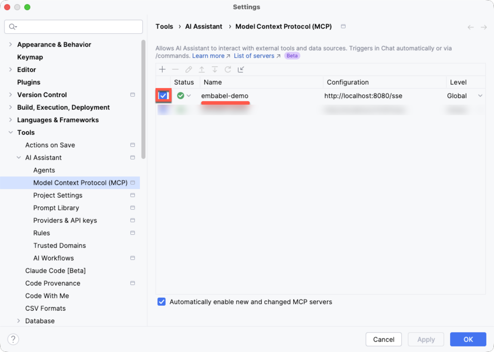

[← Previous: Docker Push](docker-push.md) | [Back to Index](../README.md) | [Next: Agents →](agents/index.md)

---

# Docker Compose

You can run this project in Docker using Docker Compose. The Docker build
uses the `all` Maven profile and runs with `config/all`.

Set the environment variables for your model provider
(if not already in your `~/.zshrc`):

**Anthropic:**
```bash
export ANTHROPIC_BASE_URL=https://<your-private-anthropic-domain>
export ANTHROPIC_API_KEY=<your-api-key>
```

**OpenAI:**
```bash
export OPENAI_BASE_URL=https://<your-private-openai-domain>
export OPENAI_API_KEY=<your-api-key>
```

**Ollama:**
No environment variables required. Docker Desktop provides
`host.docker.internal` which the container uses to reach Ollama
on the host machine.

On Linux (without Docker Desktop), you may need to set
`OLLAMA_HOST=0.0.0.0` so Ollama listens on all interfaces:
```bash
export OLLAMA_HOST=0.0.0.0
ollama serve
```

Docker Compose passes through all provider environment variables.
You only need to set the ones for your chosen provider — any
variables you have not exported will be passed as empty strings,
which is safe because the application ignores empty values.

Build and start the service:
```bash
docker compose up --build
```

The service will be available at `http://localhost:48080`.

To stop the service:
```bash
docker compose down
```

### Overriding the default models

The default LLM is `claude-sonnet-4-5`. You can override the models
by passing `-e` flags to `docker compose run`:

```bash
docker compose run \
  -e EMBABEL_MODELS_DEFAULT_LLM=gpt-4.1 \
  -e EMBABEL_MODELS_LLMS_BEST=gpt-4.1 \
  -e EMBABEL_MODELS_LLMS_CHEAPEST=gpt-4.1-mini \
  embabel-demo
```

Available models include:

| Provider  | Models                                      |
|-----------|---------------------------------------------|
| Anthropic | `claude-opus-4-1`, `claude-sonnet-4-5`      |
| OpenAI    | `gpt-4.1`, `gpt-4.1-mini`                  |
| Ollama    | `gpt-oss:20b`, `qwen3:4b`                  |

## MCP Server

> **Warning: The MCP server is currently unsecured.** There is no authentication or authorisation on the SSE endpoint. Do not expose it to untrusted networks. MCP Server Security functionality is expected in Embabel Agent 0.4.0.

This application is also an MCP (Model Context Protocol) server.
When the service is running, all agents with `@Export(remote = true)` are automatically exposed as MCP tools
via an SSE endpoint at `http://localhost:48080/sse`.

> **Note:** Some MCP tools (e.g. `writeAndReviewStory`) are long-running and may time out in JetBrains AI Assistant. For these calls, use Claude Code directly instead.

The following tools are available:

| Tool Name             | Agent                                                        | Description                                                |
|-----------------------|--------------------------------------------------------------|------------------------------------------------------------|
| `fibonacciNumbers`    | [FibonacciAgent](agents/fibonacci-agent.md)                  | Compute Fibonacci numbers using LLM with tool verification |
| `writeAndReviewStory` | [WriteAndReviewAgent](agents/write-and-review-agent.md)      | Generate a story and review it                             |
| `bestDadJoke`         | [BestDadJokeAgent](agents/best-dad-joke-agent.md)            | Create the best dad joke ever                              |
| `sonicPiCode`         | [SonicPiAgent](agents/sonic-pi-agent.md)                     | Generate Sonic Pi code from user input (not yet working via MCP) |

## Claude Code
Start the embabel-demo service, then add the MCP server to your
global Claude Code config at `~/.claude.json`:
```json
{
  "mcpServers": {
    "embabel-demo": {
      "type": "sse",
      "url": "http://localhost:48080/sse",
      "timeout": 600000
    }
  }
}
```

The 10-minute timeout (600000ms) is recommended because some agents
(e.g. `sonicPiCode`, `writeAndReviewStory`) are long-running.

Alternatively, add via the CLI (note: this does not set the timeout,
so you will need to edit `~/.claude.json` afterwards to add it):
```bash
claude mcp add embabel-demo --transport sse http://localhost:48080/sse
```

### Reconnecting After MCP Server Restart
If you restart the embabel-demo service, Claude Code will lose its connection to the MCP server. To reconnect:
1. Type `/mcp`
2. Select `embabel-demo`
3. Select `4. Reconnect`

### Example: Best Dad Joke
Use the `bestDadJoke` tool to generate a dad joke about a programming topic:
```
Tell me a dad joke about recursion.
```
If Claude Code doesn't use the MCP tool, try being explicit:
```
Use the embabel-demo MCP server to tell me a dad joke about recursion.
```

### Example: Write and Review Story
Use the `writeAndReviewStory` tool to generate a story from an incident chat log and save the output:
```
Write a story about the incident at @docs/examples/incident-chat.md. Save the result to incident-story.md.
```
If Claude Code doesn't use the MCP tool, try being explicit:
```
Use the embabel-demo MCP server to write a story about the incident at @docs/examples/incident-chat.md. Save the result to incident-story.md.
```

## GitHub Copilot
Start the embabel-demo service, then add a `.vscode/mcp.json` file to your project root:
```json
{
  "servers": {
    "embabel-demo": {
      "type": "sse",
      "url": "http://localhost:48080/sse",
      "timeout": 600000
    }
  }
}
```

Or configure via VS Code settings (`settings.json`):
```json
{
  "mcp": {
    "servers": {
      "embabel-demo": {
        "type": "sse",
        "url": "http://localhost:48080/sse",
        "timeout": 600000
      }
    }
  }
}
```

## IntelliJ IDEA Ultimate
> Requires the [GitHub Copilot plugin](https://plugins.jetbrains.com/plugin/17718-github-copilot) v1.5.57 or later.

Start the embabel-demo service, then in IntelliJ IDEA:
1. Open **GitHub Copilot Chat** (click the Copilot Chat icon on the right side of the editor)
2. Switch to **Agent** mode
3. Click the **Tools** icon, then **Add More Tools...**
4. Add the embabel-demo server to the `mcp.json` configuration file that opens:

```json
{
  "servers": {
    "embabel-demo": {
      "type": "sse",
      "url": "http://localhost:48080/sse",
      "timeout": 600000
    }
  }
}
```

Alternatively, go to **Settings | Tools | GitHub Copilot | Model Context Protocol (MCP)** and click **Configure** to edit the `mcp.json` file directly.

## JetBrains AI Assistant
Start the embabel-demo service, then in IntelliJ IDEA:
1. Go to **Settings | Tools | AI Assistant | Model Context Protocol (MCP)**
2. Click **Add** (+)
3. Select **SSE** as the connection type
4. Set the URL to `http://localhost:48080/sse`
5. Click **Apply**

Or configure via JSON (**Edit as JSON** button):
```json
{
  "mcpServers": {
    "embabel-demo": {
      "url": "http://localhost:48080/sse",
      "timeout": 600000
    }
  }
}
```

### Reconnecting After MCP Server Restart
If the MCP server is restarted, JetBrains AI Assistant may lose its connection to the server. To reconnect:
1. Go to **Settings | Tools | AI Assistant | Model Context Protocol (MCP)**
2. Untick the checkbox next to the **embabel-demo** MCP server and click **Apply**
3. Tick the same checkbox again and click **Apply**

> **Troubleshooting:** Do this if the AI Assistant cannot find the MCP server, but you know it's running.



---

[← Previous: Docker Push](docker-push.md) | [Back to Index](../README.md) | [Next: Agents →](agents/index.md)
